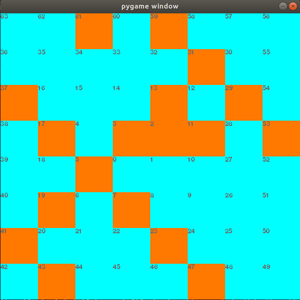
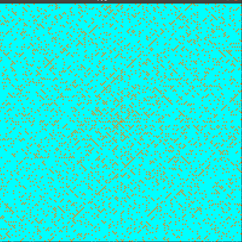

# What happens to the placement of prime numbers in unfounded expressions?

## ※ 現在製作中!

### Q: 一体、何をしようとしているのか？
### A: 「ウラムの螺旋」に倣い、単純（というかテキトー）なルールで整数を二次元、三次元空間上に配置した時、素数の配置がどのようになるか？を観察してみています。


**ただし、只々好奇心のままにアレコレやってみているだけですので、数学的な意味とかは「一切」ありません（苦笑）**  

[結城浩先生](https://www.hyuki.com/)の著書、「数学ガールの秘密ノート&emsp;-- _整数で遊ぼう_」の中で「[ウラムの螺旋](https://ja.wikipedia.org/wiki/%E3%82%A6%E3%83%A9%E3%83%A0%E3%81%AE%E8%9E%BA%E6%97%8B)」なるものが紹介されていました。  
これは、下の画像のように、グリッド状に区切られた二次元空間の中央に「０」を配置し、そこを起点に半時計回りに各整数をマス目に当てはめ、素数の入ったマス目をそれ以外と区別したもの、ということのようです。  

_An integer from 0 to 64_  


これを40,000以下の素数とすると、以下のようになります。  
パターンがあるような、無いような・・・？？？  

_An integer from 0 to 40000_  
  

･･･で、これを見た時、「パターンを替えたら素数の配置はどんな模様を描くのだろう？」と、思ってしまったわけです。  
「思ってしまった」なら、やってみない手はありませんよね？今の御時世、パソコンさえありゃ、試してみることが出来ますし。  

そんなわけで「**数学的意味とかそういったことはまるっきり抜きにして**、取り敢えずアレコレやってみよう！」  ってノリで始めて、アレコレ出てきた結果を集めたものがこのリポジトリです。  

クドいようですが、**意味なんて何もありゃしませんよ（笑）**

---  

## ローカルの環境  

ubuntuにanacondaをインストールしています  
もっとも、python3系がインストールされていれば必要なモジュールは
- numpy
- matplotlib
- jupyter notebook
- pygame (jupyter notebook内では不要)

のみです。
```
~$ conda info

...
...
user-agent : conda/4.8.3 requests/2.23.0 CPython/3.7.7 Linux/5.4.3-050403-generic ubuntu/18.04.4 glibc/2.27
...
...
```

この`README.md`で表示している「ウラムの螺旋」を描画するための`prime_grid.py`と、整数がプロットされていく様子を示す`plot_process.py`の実行する場合にのみ**pygame**モジュールが必要です。  

---  

## Index  


| file | description |
| --- | --- |
| [No1_play_with_prime_numbers.ipynb](No1_play_with_prime_numbers.ipynb)| x,y座標上に渦巻き型に整数を配置してみました。<br> 三角関数, 円周率, ネイピア数を思いつくままにテキトーに組み合わせて`matplotlib`で描画しています。|
| [No2_play_with_prime_numbers.ipynb](No2_play_with_prime_numbers.ipynb)|No1ファイルでやったことに、さらに虚数をテキトーに組み合わせます。<br>三次元空間に整数や素数をプロットして、回転させて観察できるようにしました。 |
