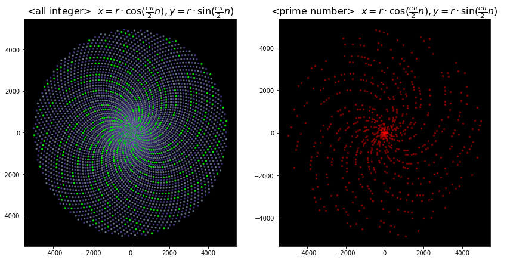
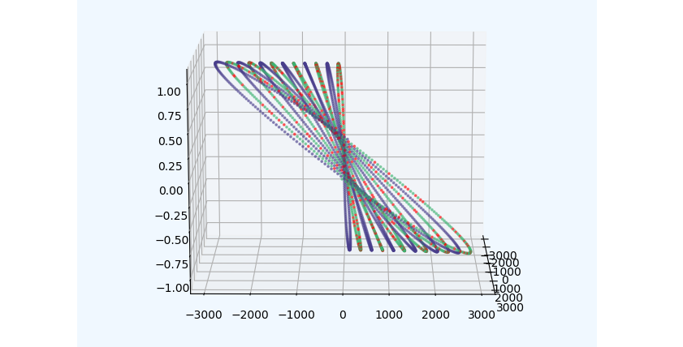
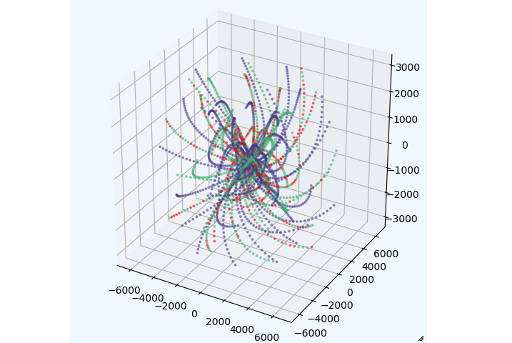
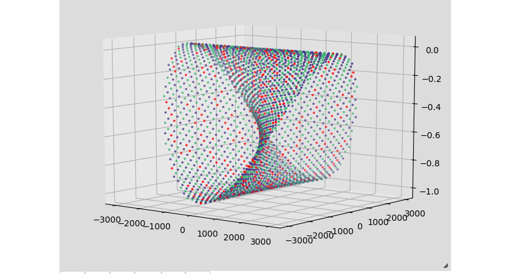
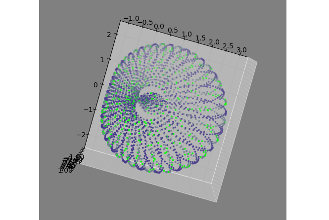

# 何ら根拠のないルールに則って整数を並べた時、素数はどのような形に並ぶのだろうか？
## 「ウラムの螺旋」の真似事をして遊んでみる。

---  

  

### Q: 一体、何をしようとしているのか？
### A: 「ウラムの螺旋」に倣い、単純（というかテキトー）なルールで整数を二次元、三次元空間上に配置した時、素数の配置がどのようになるか？を観察してみています。


**ただし、只々好奇心のままにアレコレやってみているだけですので、数学的な意味とかは「一切」ありません（苦笑）**  

[結城浩先生](https://www.hyuki.com/)の著書、「数学ガールの秘密ノート&emsp;-- _整数で遊ぼう_」の中で「[ウラムの螺旋](https://ja.wikipedia.org/wiki/%E3%82%A6%E3%83%A9%E3%83%A0%E3%81%AE%E8%9E%BA%E6%97%8B)」なるものが紹介されていました。  
これは、下の画像のように、グリッド状に区切られた二次元空間の中央に「０」を配置し、そこを起点に半時計回りに各整数をマス目に当てはめ、素数の入ったマス目をそれ以外と区別したもの、ということのようです。  

_An integer from 0 to 64_  


これを40,000以下の素数とすると、以下のようになります。  
パターンがあるような、無いような・・・？？？  

_An integer from 0 to 40000_  
  

･･･で、これを見た時、「パターンを替えたら素数の配置はどんな模様を描くのだろう？」と、思ってしまったわけです。  
「思ってしまった」なら、試してみない手はありませんよね？今の御時世、パソコンさえありゃ、試してみることが出来ますし。  

そんなわけで「**数学的意味とかそういったことはまるっきり抜きにして**、取り敢えずアレコレやってみよう！」  ってノリで始めて、アレコレ出てきた結果を集めたものがこのリポジトリです。  

クドいようですが、**意味なんて何もありゃしませんよ（笑）**

---  

## ローカルの環境  

※**興味を持たれた方で"jupyter notebook"を使用できる環境がある方は、No.2ファイル以降の3Dグラフをローカル環境で回転させて、いろいろな方向から観察してみて下さい**  

ubuntuにanacondaをインストールしています  
もっとも、python3系がインストールされていれば必要なモジュールは
- numpy
- matplotlib
- jupyter notebook
- pygame (jupyter notebook内では不要)

のみです。
```
~$ conda info

...
...
user-agent : conda/4.8.3 requests/2.23.0 CPython/3.7.7 Linux/5.4.3-050403-generic ubuntu/18.04.4 glibc/2.27
...
...
```

この`README.md`で表示している「ウラムの螺旋」を描画するための`prime_grid.py`と、整数がプロットされていく様子を示す`plot_process.py`を実行するには、**pygame**モジュールが必要になります。  

---  

## Index  

※ Github上でファイルを表示させようとすると（特にNo1ファイルは）少々時間がかかります。

| file | image |description |
| --- | --- | --- |
| [No1_play_with_prime_numbers.ipynb](No1_play_with_prime_numbers.ipynb)| | xy座標上に渦巻き型に整数を配置してみました。<br> 三角関数, 円周率, ネイピア数を思いつくままにテキトーに組み合わせて`matplotlib`で描画しています。|
| [No2_play_with_prime_numbers.ipynb](No2_play_with_prime_numbers.ipynb)| |No1ファイルでやったことに、さらに虚数をテキトーに組み合わせます。<br>三次元空間に整数や素数をプロットして、回転させて観察できるようにしました。 |
| [No3_play_with_prime_numbers.ipynb](No3_play_with_prime_numbers.ipynb)| | 渦巻状に配置された、 xy平面上の点、(n×cosθ, n×sinθ)を、中心点から各点へのベクトルに直交する複素平面でさらにcos + i sinθの位置まで動かしてプロットしていきます |
| [No4_play_with_prime_numbers.ipynb](No4_play_with_prime_numbers.ipynb)| | 回転の要領はNo3ファイルと同じで、複素数を生成する式を変更し、さらにそれらの実数部、虚数部を（それぞれに対応した数で）整数倍します。 |
| [No5_play_with_prime_numbers.ipynb](No5_play_with_prime_numbers.ipynb)| | No.4では、複素平面をベクトル (𝑥,𝑦) に直交するように配置しましたが、今回はベクトルと同じ直線上にxy平面と直交するように配置してプロットする点を移動させます。 |
| [No6_play_with_prime_numbers.ipynb](No6_play_with_prime_numbers.ipynb)|  | 「ウラムの螺旋を模倣する」コンセプトからは外ているが、パターンが面白いので残しておいたもの。<br>結構面白いパターンが出現しています。|
