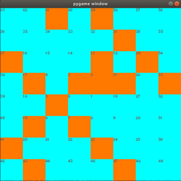
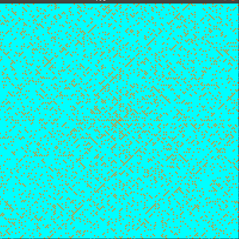
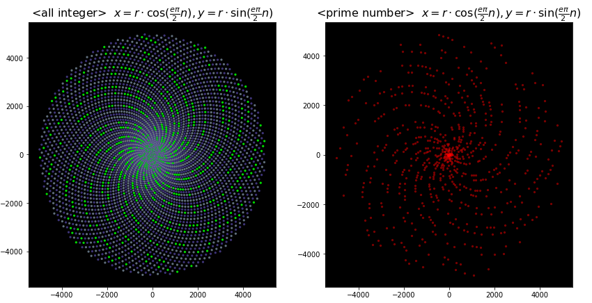
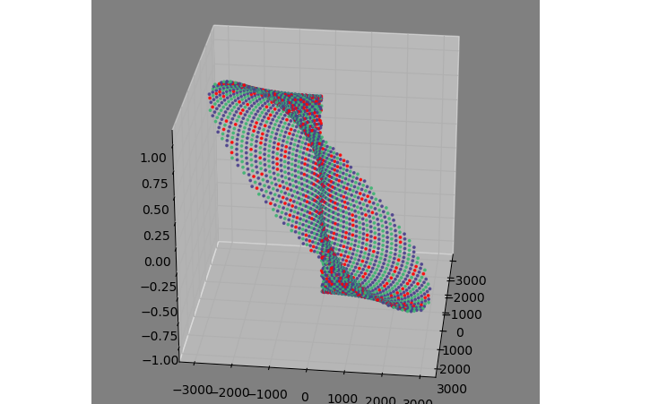
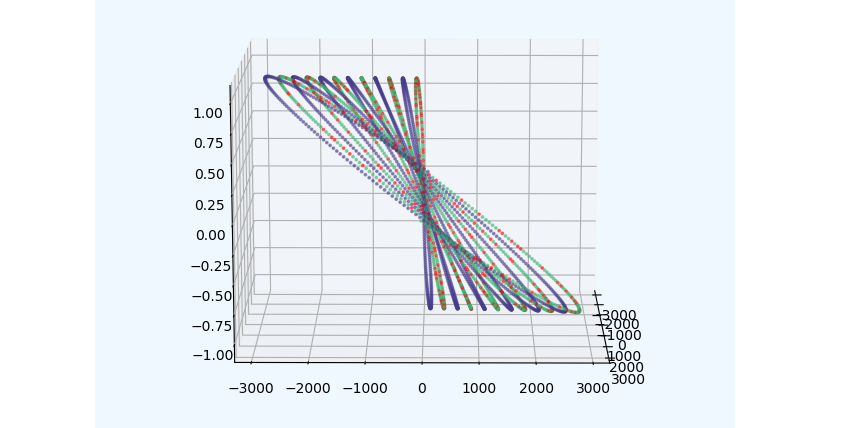
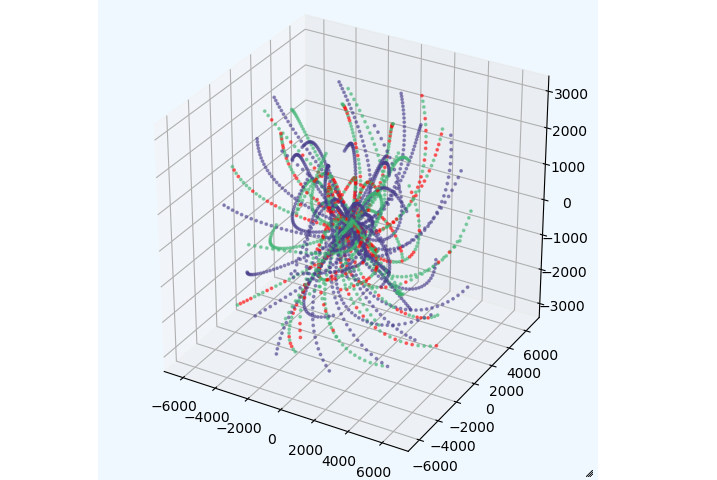
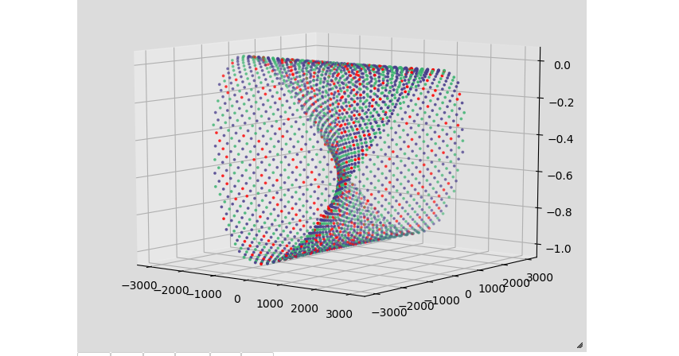
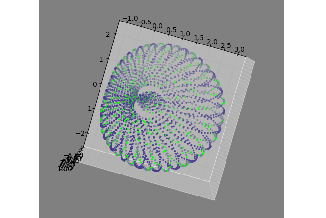
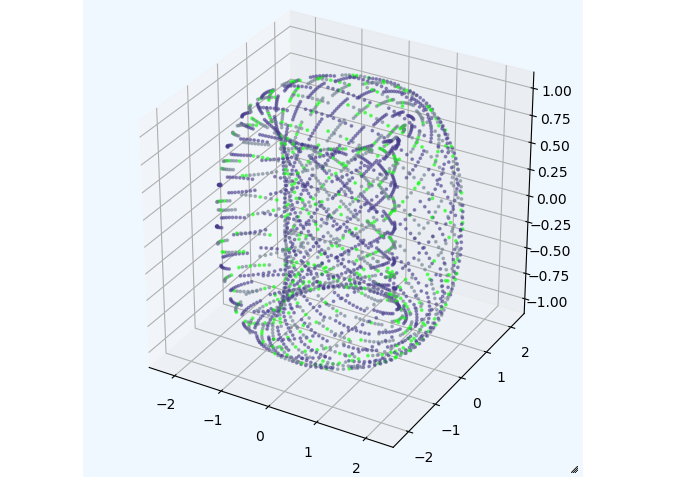

# What happens to the placement of prime numbers in unfounded expressions?

### Q: What is this repository?  
### A: Mimicking the "Ulam spiral", observe how prime numbers are arranged when integer values ​​are plotted according to a simple rule.


**But here I'm just trying things out of curiosity.　Mathematical correctness is not considered at all.**:sweat_smile:  


"[Ulam's Spiral](https://ja.wikipedia.org/wiki/%E3%82%A6%E3%83%A9%E3%83%A0%E3%81%AE%E8%9E%BA%E6%97%8B)" was introduced in [Mr. Hiroshi Yuki's](https://www.hyuki.com/) book "Mathematic Girl's Secret Note: Let's Play with Integers".  
This seems to say something like the image below.
- Place a "0" in the center of the grid.
- Plot the integers counterclockwise around that point.
- Allows the position of prime numbers to be - distinguished from other numbers (for example, by color coding).  

_An integer from 0 to 64_  


If this is a prime number less than 40,000, then  
:confused: There is a pattern, there is no pattern ...???

_An integer from 0 to 40000_  
  

When I saw this, I thought this way  

"What happens to the pattern when the **spiral is changed**?"    

So I decided to try it.  
Thankfully, these days it's easy to try it out even with the cheap computer I use. 　

"**Let's do it anyway!**"  
 This repository is a collection of the result of starting with such a light feeling.  

**Again, this has no "meaning"** :stuck_out_tongue_closed_eyes:

---  

## Local environment  

I have anaconda installed on ubuntu.  
All you really need is Python3 and the following modules:  

- numpy
- matplotlib
- jupyter notebook
- pygame (Not required in "jupyter notebook")

The "pygame" module is only needed to run "prime_grid.py" and "plot_process.py".  

```
~$ conda info

...
...
user-agent : conda/4.8.3 requests/2.23.0 CPython/3.7.7 Linux/5.4.3-050403-generic ubuntu/18.04.4 glibc/2.27
...
...
```


---  

## Index  

_It may take some time before it is displayed._

| file | image |description |
| --- | --- | --- |
| [No1_play_with_prime_numbers.ipynb](No1_play_with_prime_numbers.ipynb)| | I tried to arrange the integers in a spiral shape on the xy coordinates.<br> (simply in the form I came up with) <br>CombineTrigonometric function, Pi and Napier number and draw the result in "matplotlib".|
| [No2_play_with_prime_numbers.ipynb](No2_play_with_prime_numbers.ipynb)| |Combine the imaginary number with the contents of the No.1 file. (This is also a vague idea. There is no "reason")<br>It is plotted in 3D space so you can see it from different angles (when run in a local "jupyter notebook"). |
| [No3_play_with_prime_numbers.ipynb](No3_play_with_prime_numbers.ipynb)| | Move the spirally arranged points (n×cos θ, n×sin θ) on the xy plane to the position of cos +isin θ on the complex plane perpendicular to the vector from the center point to each point and plot it. |
| [No4_play_with_prime_numbers.ipynb](No4_play_with_prime_numbers.ipynb)| | The procedure of rotation is the same as the procedure of No3 file, the formulas for generating complex numbers are changed, and their real and imaginary parts are multiplied by an integer (corresponding number). |
| [No5_play_with_prime_numbers.ipynb](No5_play_with_prime_numbers.ipynb)| | In No.4, the complex plane was placed so as to be orthogonal to the vector (x, y), but this time it is placed so that it is orthogonal to the xy plane on the same straight line as the vector, and the points to be plotted are moved.  |
| [No6_play_with_prime_numbers.ipynb](No6_play_with_prime_numbers.ipynb)|  | It's not a concept of "mimicking the Ulam spiral, but I left it because the pattern that appeared was interesting.|
